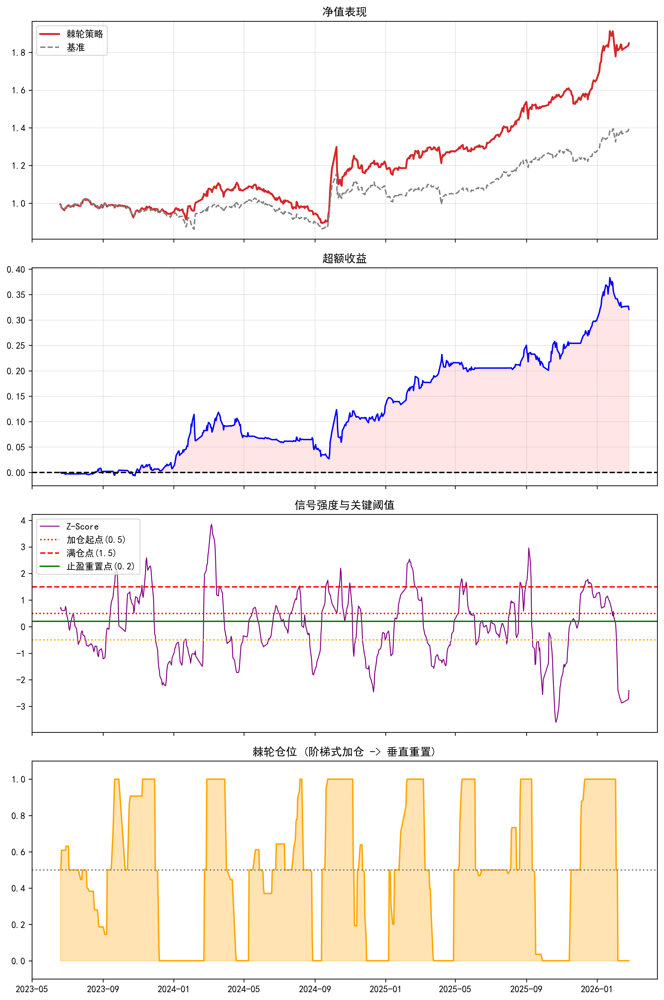

# 📈 情绪驱动棘轮策略 (Sentiment-Driven Ratchet Strategy)

> 本策略通过量化市场情绪残差，结合多周期动量与棘轮式仓位管理，在控制回撤的同时捕捉趋势机会。以下为完整逻辑解析。

---

## 📚 目录
1. [策略核心思想](#策略核心思想)
2. [模块详解](#模块详解)
   - [2.1 情绪残差因子计算](#21-情绪残差因子计算)
   - [2.2 趋势反转信号合成](#22-趋势反转信号合成)
   - [2.3 棘轮仓位管理](#23-棘轮仓位管理)
   - [2.4 回测执行细节](#24-回测执行细节)
3. [关键参数说明](#关键参数说明)
4. [策略优势总结](#策略优势总结)

---

## 策略核心思想
**“用情绪残差识别市场非理性，用棘轮机制锁定利润”**  
- 从指数收益中剥离交易活跃度影响 → 提取情绪驱动残差  
- 多周期动量合成 → 识别高性价比交易窗口（顺趋势+捕反转）  
- 棘轮仓位管理 → 加仓后“只进不退”，跌破阈值才重置，避免情绪化操作  
- 动态再平衡 + 交易成本建模 → 贴近实盘逻辑

---

## 模块详解

### 2.1 情绪残差因子计算
```python
def calc_sentiment_residual(series_ret, series_val, series_mv, window):
    # 构建交易活跃度代理变量
    if series_mv.sum() == 0 or series_mv.isna().all():
        tr = np.log(series_val)          # 无市值时：对数成交额
        delta_tr = tr.diff()
    else:
        tr = series_val / series_mv      # 有市值时：换手率 = 成交额/流通市值
        delta_tr = tr / tr.shift(1) - 1  # 换手率日变化率
    
    delta_tr = delta_tr.replace([np.inf, -np.inf], np.nan).fillna(0)
    
    # 滚动窗口线性回归：收益率 = α + β × 活跃度变化 + 残差
    cov = series_ret.rolling(window).cov(delta_tr)
    var = delta_tr.rolling(window).var()
    beta = cov / var
    alpha = series_ret.rolling(window).mean() - beta * delta_tr.rolling(window).mean()
    
    return series_ret - (alpha + beta * delta_tr)  # 返回“情绪残差”
```
#### ✅ 作用：
- 提取“无法被交易活跃度解释的异常收益”，作为情绪代理指标
- 生成 Sent_500（中证500情绪）与 Sent_HL（红利低波情绪）
- 后续计算 Factor_Cum = (Sent_500 - Sent_HL).cumsum() → 情绪分化累积趋势
#### 💡 设计精髓：
换手率标准化消除规模影响；滚动回归适应市场时变性；残差聚焦“非理性波动”

### 2.2 趋势反转信号合成
```python
df['Mom_Mid'] = df['Factor_Cum'].diff(MID_TERM_WINDOW)   # 20日中期动量
df['Mom_Short'] = df['Factor_Cum'].diff(SHORT_TERM_WINDOW) # 4日短期动量
df['Alpha_Score'] = df['Mom_Mid'] - (REVERSAL_WEIGHT * df['Mom_Short'])  # REVERSAL_WEIGHT=0.8
df['Alpha_Score_Smooth'] = df['Alpha_Score'].rolling(3).mean()  # 3日平滑降噪
```
#### ✅ 信号逻辑：
| 场景 | Mom_Mid | Mom_Short | Alpha_Score | 策略动作 |
|------|---------|-----------|-------------|----------|
| 黄金买点 | +（中期向上） | -（短期回调） | 显著增强 | 棘轮加仓 |
| 追高风险 | +（中期向上） | +（短期暴涨） | 信号抑制 | 暂停加仓 |
| 黄金卖点 | -（中期向下） | +（短期反弹） | 显著增强（负值） | 减仓/反向 |
| 杀跌陷阱 | -（中期向下） | -（短期暴跌） | 信号抑制 | 避免恐慌 |

#### 💡 设计精髓：
Alpha_Score = 中期趋势 - 0.8×短期动量 → 本质是 “趋势跟踪 + 均值回归”融合
- 短期回调 → 信号增强（“买在分歧”）
- 短期暴涨 → 信号减弱（“卖在一致”）
- 平滑处理避免噪音干扰

### 2.3 棘轮仓位管理
```python
def calculate_ratchet_weight(z_values, start, full, reset):
    weights = []
    current_w = 0.5  # 初始标配：50%中证500 + 50%红利
    
    for z in z_values:
        if current_w > 0.5:  # 持有中证500多头
            if z < reset:        # 跌破重置阈值（0.2）
                current_w = 0.5  # 止盈重置，回归标配
            else:
                raw_w = 0.5 + 0.5 * (z - start) / (full - start)  # 理论仓位
                current_w = max(current_w, raw_w)  # 只增不减（棘轮核心！）
        
        elif current_w < 0.5:  # 持有红利多头（中证500空头）
            if z > -reset:       # 反弹超-0.2
                current_w = 0.5  # 空头平仓
            else:
                raw_w = 0.5 - 0.5 * (abs(z) - start) / (full - start)
                current_w = min(current_w, raw_w)  # 500仓位只降不升
        
        else:  # current_w == 0.5（标配区）
            if z > start: current_w = 0.51  # 启动做多
            elif z < -start: current_w = 0.49  # 启动做空
        
        weights.append(current_w)
    return np.array(weights)
```
#### ✅ 棘轮机制三原则：
- 加仓锁定：信号增强时加仓，但信号减弱时不减仓（max(current_w, raw_w)）
- 止盈重置：Z-Score跌破THRES_RESET=0.2 → 强制回归50%标配，锁定利润
- 对称设计：做空方向逻辑镜像（阈值取负，仓位操作取反）

#### 📊 仓位行为可视化：
```
仓位
1.0 |       ┌───────┐
    |       │       │
0.5 |───────┘       └─────── (重置点触发垂直回落)
    |               │
0.0 |               └───────
    +------------------------> 时间
      加仓区      重置点
```
#### 💡 设计精髓：
模拟“机械式纪律”：避免人性弱点（过早止盈/扛单），用规则锁定趋势利润

### 2.4 回测执行细节
```python
# T+1执行：今日信号决定明日仓位
df['Exec_Weight'] = df['Target_Weight'].shift(1)

# 动态再平衡（关键！）
for i in range(len(df_bt)):
    r_day = w_curr * ret_500[i] + (1 - w_curr) * ret_hl[i]  # 当日组合收益
    w_curr = w_curr * (1 + ret_500[i]) / (1 + r_day)        # 按资产增值调整权重
    w_curr = np.clip(w_curr, 0.0, 1.0)                       # 限制在[0,1]

# 交易成本建模
df_bt['Turnover'] = (df_bt['W_500'] - df_bt['W_500'].shift(1)).abs()
df_bt['Strat_Ret'] = raw_ret - (df_bt['Turnover'] * (COST + SLIPPAGE) * 2)
```
#### ✅ 关键设计：
| 环节 | 说明 | 为何重要 |
|------|------|----------|
| T+1执行 | 信号延迟一日生效 | 避免前视偏差，符合A股T+1规则 |
| 动态再平衡 | 每日按资产增值重算权重 | 真实反映仓位漂移，避免高估收益 |
| 双边成本 | 换手率 × (手续费+滑点) × 2 | 买卖各计一次成本，贴近实盘 |
| 基准设定 | 50%中证500 + 50%红利低波 | 合理对比策略超额能力 |
#### 💡 设计精髓：
回测不仅计算收益，更模拟资金曲线真实演化过程，结果更具实盘参考价值

#### 📊 回测结果可视化



> **图表说明**  
> - **上图**：策略净值 vs 基准（50%中证500 + 50%红利低波）  
> - **中图**：累计超额收益（红色区域为正超额）  
> - **下图**：Z-Score 信号强度与棘轮仓位动态（阶梯加仓 + 垂直重置）  
> *数据区间：{BACKTEST_START_DATE} 至 {实际结束日期} | 交易成本：0.05%*

### 关键参数说明
| 参数 | 默认值 | 作用 | 调整建议 |
|------|--------|------|----------|
| `SENTIMENT_WINDOW` | 30 | 情绪残差回归窗口 | 市场波动大时可缩短 |
| `MID_TERM_WINDOW` | 20 | 中期趋势窗口 | 决定策略周期属性 |
| `SHORT_TERM_WINDOW` | 4 | 短期反转窗口 | 捕捉超买超卖 |
| `REVERSAL_WEIGHT` | 0.8 | 反转信号权重 | >1增强反转，<0.5弱化 |
| `STRENGTH_WINDOW` | 60 | Z-Score计算窗口 | 影响信号标准化尺度 |
| `THRES_START` | 0.5 | 棘轮启动阈值 | 降低→更敏感，提高→更稳健 |
| `THRES_FULL` | 1.5 | 满仓阈值 | 控制最大风险暴露 |
| `THRES_RESET` | 0.2 | 止盈重置阈值 | 关键！ 决定利润保护力度 |
| `COST + SLIPPAGE` | 0.0005 | 单边交易成本 | 根据券商费率调整 |

### 策略优势总结

#### 四重防护机制
- 信号层：情绪残差 + 多周期动量 → 过滤噪音，聚焦有效信号
- 仓位层：棘轮机制 → “让利润奔跑，cut loss quickly"
- 执行层：T+1 + 动态再平衡 → 消除回测幻觉
- 成本层：显式建模交易成本 → 避免过度交易陷阱
#### 适用场景
- 震荡市中捕捉情绪错杀机会
- 趋势市中通过棘轮机制放大收益
- 需要严格纪律约束的投资者（避免情绪化操作）
#### 注意事项
- 依赖高质量情绪数据（成交额、流通市值）
- 棘轮机制在频繁震荡市中可能增加换手
- 需定期验证阈值参数在当前市场环境的有效性


