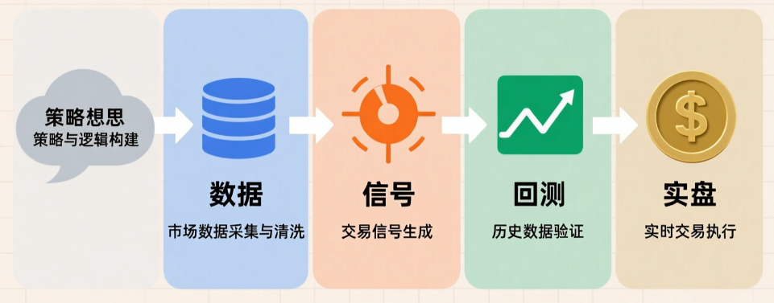

# 量化学习手册

> 面向中文读者的量化入门手册。本手册主要整理了量化领域的基础框架、量化所需的相关知识，以及量化研究领域的工作流，以及个人的一部分量化研究成果。第一版已完结，第二版持续更新中...

## 📚 目录
- [前言](#前言)
- [安装](#安装)
- [符号](#符号)
- [1 量化策略分类](#1-量化策略分类)
  - [1.1 量价策略](#11-量价策略)
  - [1.2 多因子策略](#12-多因子策略)
  - [1.3 统计套利策略](#13-统计套利策略)
  - [1.4 事件驱动策略](#14-事件驱动策略)
  - [1.5 高频交易策略](#15-高频交易策略)
  - [1.6 另类数据策略](#16-另类数据策略)
  - [1.7 机器学习策略](#17-机器学习策略)

- [2 量化数据基础](#2-量化数据基础)
  - [2.1 数据类型](#21-数据类型)
  - [2.2 数据源](#22-数据源)
  - [2.3 数据质量和清洗](#23-数据质量和清洗)
  - [2.4 数据存储和管理](#24-数据存储和管理)

- [3 因子研发工作流](#3-因子研发工作流)
  - [3.1 什么是因子](#31-什么是因子)
  - [3.2 因子逻辑梳理](#32-因子逻辑梳理)
  - [3.3 数据准备和预处理](#33-数据准备和预处理)
  - [3.4 因子构建](#34-因子构建)
  - [3.5 因子有效性检验](#35-因子有效性检验)
  - [3.6 其他](#36-其他)

- [4 策略制定工作流](#4-策略制定工作流)
  - [4.1 信号序列生成](#41-信号序列生成)
  - [4.2 多因子信号组合优化](#42-多因子信号组合优化)
  - [4.3 仓位管理机制](#43-仓位管理机制)
  - [4.4 引入交易成本](#44-引入交易成本)
  - [4.5 风险控制](#45-风险控制)
  - [4.6 其他](#46-其他)

- [5 回测验证工作流](#5-回测验证工作流)
  - [5.1 回测验证工作流](#5-回测验证工作流)

- [6 实盘部署工作流](#6-实盘部署工作流)
  - [6.1 API对接](#61-API对接)

- [7 个人量化研究成果](#7-个人量化研究成果)
  - [7.1 CAPROT](#71-CAPROT)
  - [7.2 EMS](#72-EMS)
  - [7.3 RTVR_TSM](#73-RTVR_TSM)
  - [7.4 EDICT](#74-EDICT)

- [量化产品种类](#8-量化产品种类)

- [9  策略生命周期管理](#9-策略生命周期管理)

- [10 风险管理进阶](#10-风险管理进阶)
  - [10.1 黑天鹅应对](#101-黑天鹅应对)

- [11 量化中的机器学习](#11-量化中的机器学习)

- [12 从业者指南](#12-从业者指南)
  - [12.1 量化职业路径](#121-量化职业路径)
  - [12.2 量化面试准备](#122-量化面试准备)
  - [12.3 量化社区资源](#123-量化社区资源)
  - [12.4 量化书籍推荐](#124-量化书籍推荐)
  - [12.5 量化工具推荐](#125-量化工具推荐)
  - [12.6 量化合规要点](#126-量化合规要点)

- [我的多平台量化软件](#13-我的多平台量化软件)
  - [13.1 软件功能](#131-软件功能)

## 前言
> 这本书代表了我的尝试——让量化交易亦可平易近人，教会人们概念、背景和代码。

### 量化交易总览图

## 安装
> 我们需要配置一个环境来运行 Python、Jupyter Notebook、相关库以及运行本书所需的代码，以快速入门并获得动手学习经验。

## 符号

## 1 量化策略分类

### 1.1 量价策略
> 主要基于开盘价、收盘价、最高价、最低价和成交量等市场交易数据
- 正在研究中的策略：CAPROT EMS RTVR_TSM EDICT
### 1.2 多因子策略
> 目前机构量化中最主流的策略之一。它不单纯依赖价格走势，而是通过挖掘多个“因子”来预测股票未来的超额收益。
- 基本面因子：如市盈率 (PE)、市净率 (PB)、ROE、营收增长率、现金流等。
- 成长因子：净利润增速、分析师预期上调幅度等。
- 价值因子：低估值选股。
- 质量因子：高盈利能力、低负债率。
- 逻辑：通过线性或非线性模型（如机器学习）将几十甚至上百个因子合成一个综合得分，买入得分高的股票，卖空或低配得分低的股票。
### 1.3 统计套利策略
> 基于统计学原理，寻找资产价格之间的暂时性偏离，并赌其回归正常关系。
- 配对交易 (Pairs Trading)：寻找两只历史走势高度相关的股票（如可口可乐和百事可乐），当两者价差异常扩大时，做空强势股、做多弱势股，等待价差收敛。
- 均值回归：认为价格波动围绕某个均值进行，当价格大幅偏离均线时进行反向操作。
- 协整策略：比相关性更严格的数学关系，用于构建多空组合。
### 1.4 事件驱动策略
> 不依赖连续的价格序列，而是针对特定的公司事件或宏观事件进行交易。
- 财报季策略：在财报发布前后，根据超预期或低于预期的程度，结合历史反应模式进行交易（如“盈余公告后漂移” PEAD）。
- 并购套利 (Merger Arbitrage)：在宣布并购后，买入被收购方，做空收购方（或仅买入被收购方），赚取宣布价与最终成交价之间的价差，赌并购成功。
- 指数 rebalancing：在指数成分股调整生效日前后，利用被动基金的调仓行为获利。
- 回购/分红事件：针对公司宣布大额回购或高分红计划时的市场反应。
### 1.5 高频交易策略
> 虽然也属于量价范畴，但其技术门槛和逻辑与传统量价策略完全不同，主要依靠极快的速度和微观结构。
- 做市策略 (Market Making)：同时挂买单和卖单，赚取买卖价差 (Bid-Ask Spread)，并提供流动性获取交易所返佣。
- 延迟套利：利用不同交易所或不同数据源之间的微小时间差进行套利。
- 订单流分析：分析 Level-2 或 Level-3 的逐笔委托数据，识别大单意图（如冰山订单）并跟随或反向操作。
### 1.6 另类数据策略
> 随着大数据的发展，这类策略越来越重要。它们使用非传统的金融数据。
- 舆情分析 (NLP)：爬取新闻、社交媒体（如Twitter、微博、股吧）、研报，利用自然语言处理技术分析市场情绪（正面/负面）。
- 卫星图像：通过分析停车场车辆数量预测零售商营收，或通过油罐阴影长度预测原油库存。
- 供应链数据：追踪货运、海关数据等。
- 消费数据：信用卡刷卡记录、电商销售数据等。
### 1.7 机器学习策略
> 这不是一个独立的策略类别，而是一种方法论，可以应用于上述所有策略中，但近年来已独立成派。
- 非线性映射：使用深度学习（如 LSTM, Transformer, GNN）直接从原始数据（甚至包括K线图图像、文本）中学习特征，不再依赖人工定义的因子。
- 强化学习 (Reinforcement Learning)：让AI代理在模拟环境中通过试错学习最优的交易执行路径或仓位管理策略。

## 3 因子研发流程

### 3.1 什么是因子
> 因子是量化投资中用于预测资产未来表现的变量。通俗来说，就是制定交易策略所需要的“信号”。它们可以是基于价格、基本面、技术指标、情绪等多种类型的数据。因子是量化交易的起点，只有构建出了信号，策略才有了依据。
### 3.3.1 生产环境中常见因子
- 价格动量因子：如过去12个月的收益率。
- 价值因子：如市盈率 (PE)、市净率 (PB)
- 成长因子：如净利润增速、营收增速。
- 质量因子：如ROE、毛利率。
- 波动率因子：如过去30天的收益率标准差。

值得注意的是，因子并不一定是单一的指标，它们可以是多个指标的组合（如多因子模型中的综合得分），也可以是通过机器学习从原始数据中提取的特征。无论是哪种形式，因子都需要经过严格的检验和验证，才能在实盘中使用。

### 3.2 因子逻辑梳理
> 在构建因子之前，首先需要明确因子的投资逻辑和理论基础

### 3.3 数据准备和预处理
> 因子构建需要大量的历史数据，数据的质量和预处理直接影响因子的有效性。